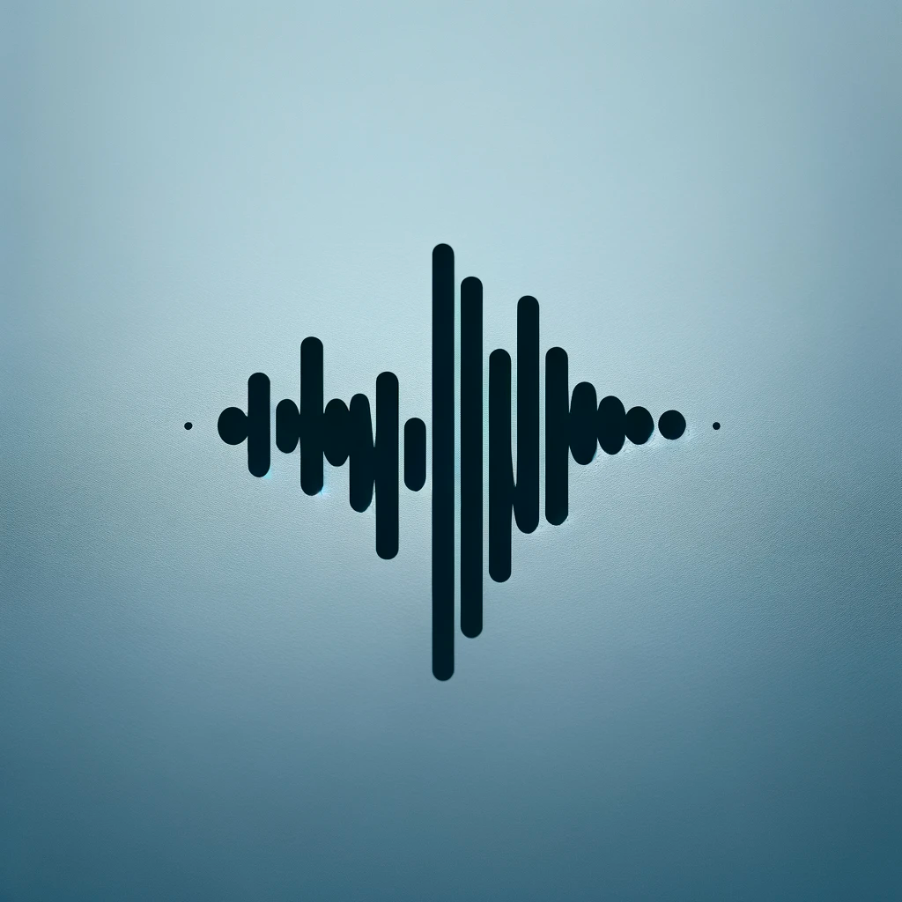

<p align="center">
    
</p>

# PyPSOLA: Shift pitches without affecting duration

If you want to shift the pitch of audio data without affecting the duration, you might have already discovered that it's quite non-trivial, but the PSOLA algorithm is here to help. This project offers a small suite of python functions to provide an API for developers to use the PSOLA algorithm in Python!

This project consists of the following Python modules:

1. `psola.py`: The PSOLA (Pitch Synchronous Overlap Add) technique, which is a widely used method in speech synthesis and pitch modification.

2. `pitch_detection.py`: This module currently only contains the auto correlate method to determine pitches

## Requirements

- Python 3.x
- NumPy: The only external library used in this project, essential for its array manipulation and numerical operations capabilities.

## Usage

Import the modules as needed in your Python scripts to utilize their functions for audio analysis and processing tasks. 

Example:
```python
from your_project_name import psola, pitch_detection
```

## Contributing

Contributions to this project are welcome. Please ensure that your code adheres to the existing style and that all new functionalities are properly documented.
